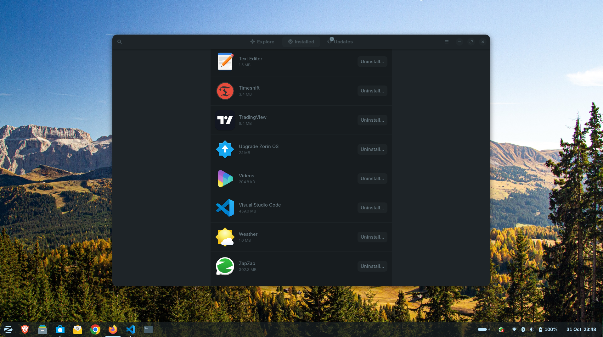

# Zorin OS Applications Setup using Ansible

Playbook for minimum software and tools required for a software developer.



### Dependencies

- [Ansible](https://docs.ansible.com/ansible/latest/installation_guide/intro_installation.html)
- [Python](https://www.python.org/downloads/)

### How it run

```bash
❯ ansible-playbook -K aptitude.yml
BECOME password: 

PLAY [localhost] **********************************************************************************

TASK [Gathering Facts] ***************************************************************************************************
ok: [localhost]

TASK [Install apt packages] ***************************************************************************************************
ok: [localhost]

PLAY RECAP ****************************************************************************************
localhost   : ok=2    changed=0    unreachable=0    failed=0    skipped=0    rescued=0    ignored=0 
```